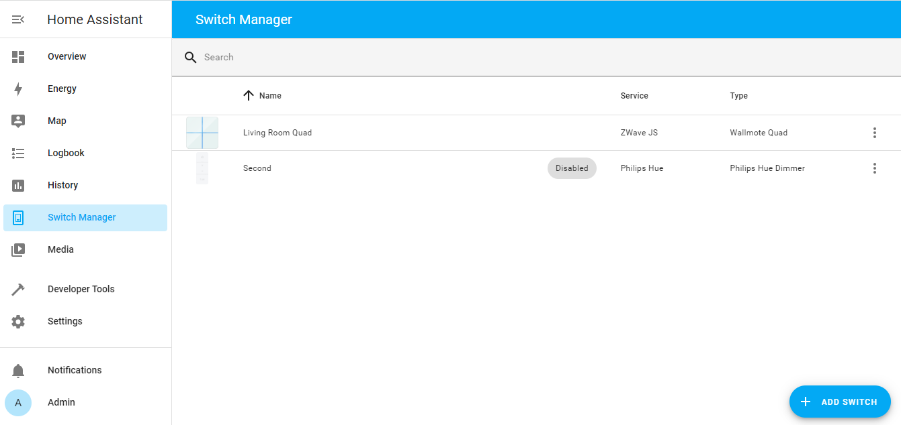

# Home Assistant Switch Manager [@Sian-Lee-SA](http://github.com/Sian-Lee-SA)

[](https://github.com/hacs/integration)


## About

Switch manager is a centralised component to handle button pushes for your wireless switches. This includes anything passed through the event bus or MQTT. The component relies on switch blueprints which is easily made to allow GUI configuration of your switches and their button pushes. This helps remove clutter from the automations view as they will be handled independently by this component.

> I am happy to accept any pull requests for anyone who wishes to submit missing blueprint for switches from this repository as to help eliminate other users from having to build their own.

#### Index page


#### Switch editor page


## How to install

1. Download the [component](https://github.com/Sian-Lee-SA/Home-Assistant-Switch-Manager/releases)
1. Place the folder `custom_components/switch_manager` into the `config/custom_components/` path of your home assistant installation
1. Restart Home Assistant
1. Goto Config -> Integration then find and add Switch Manager

> [](https://my.home-assistant.io/redirect/config_flow_start/?domain=switch_manager)

Once the integration has been loaded, a folder with blueprints will be created in your `config/blueprints/switch_manager` home assistant path. You can add/create extra blueprints to this path.

## How to use

In the side panel you goto Switch Manager. Next click `Add Switch` and select the switch blueprint for the service/integration it's on (If you can't find your service and switch then see [Blueprints](#blueprints) below). The same switch can be defined multiple times but not for different services as they differ their event data's from one another. 

Once you've selected the blueprint, you will be taken to the switch editor view. There will be an identifier or mqtt topic input box up in the top left with a placeholder asking for the value for that key within the event data or mqtt topic. 

You can either enter the identifier manually or use the button on the right then press a button on the switch to auto fill the value. There is a posibility that an identifier from some other device for the event to be discovered if that device sent an event before your button push. If this is the case and the button helper isn't getting the right identifier then follow the next step to discover it manually. 

* If you do not know the event value then goto Developer Tools -> Events and start listening for events (use * if you're unsure of the event type for your switch). Once you've started listening for events, push a button on your switch then stop the listener. View the data and you will find the event related to your switch. Inside that data you will find the identifier's value. Copy this value to the identifier's textbox on the switch editor page to bind.

Depending on the blueprint and the actions that your switch supports, you can select buttons by clicking on them from the image displayed and each button can have multiple actions eg tap, double tap and hold etc. 

Navigation and usage should be pretty straight forward. Next you can start defining sequences for each of your buttons and actions. The sequence process is identical to making a script in Home Assistant and should be familiar. 

Once saved you can test to make sure all is working.

> Sometimes you may want certain buttons or actions handled by the devices default handler. For example, a Zigbee device may already be bound to a certain light which also imo has better response, reliability and stability. To remind you of this, you could add a stop action with a description of why the button shouldn't be changed and being handled somehwere else. Then for other actions that aren't handled else where then you can handle them with this component. It's also fine to allow an external handler to handle the button push aswell as this component so a button could turn on the light handled via Zigbee and the component could start playing music based on the same switch action.

## Blueprints

Blueprints are the heart of this component, once a blueprint is defined for a switch then it can be reused for all switches for that specific service and type. All blueprints are yaml defined and needs to be placed inside the `config/blueprints/switch_manager` path eg `config/blueprints/switch_manager/philips-hue-tap.yaml`. For a more user friendly experience and for switches with multiple buttons then a png file should be placed with the same name (case sensitive) eg a philips-hue-tap.yaml blueprint image would be `config/blueprints/switch_manager/philips-hue-tap.png`.

> file names should be defined as {service-name}-{switch-name-or-type}.yaml and all lower case. If you don't plan on posting your blueprint for others to use then it would be a good idea to prefix your file names with something unique like mycustom-{service-name}-{switch-name-or-type}.yaml. This way when you update the component with new blueprints then it won't overwrite your personal made ones if they happen to have the same file name.

* Only PNG files are currently supported.
* Images should not exceed 500px height or 800px width
* Images with transparent background are preferred

> View other blueprint files to get a grasp on how it's constructed if the following table is hard to understand.

> For images, I tend to just google the device under the images tab. Next I will skim through til I find an image that has a flat perspective (top down) and is above 800px or 500px depending on the switches ratio. Next I will open the image in photoshop then mask out the background area with the shape tool. I then control click the layer to make only the visible selected which I then crop. Lastly I resize the image to be either 800px width or 500px height depending on which one has a greater value but I do not upscale if the image is below those sizes.

Once a blueprint file or image file has been created or edited then you will need to restart Home Assistant for the changes to take effect.

The following tables shows how to structure a blueprint yaml file

### Root Structure

Option          | Values       | Required | Details
--              | -            | -        | -
name            | `string`     | *        | A friendly name for the switch
service         | `string`     | *        | The service or integration that this switch relates to (matching services will be grouped when selecting a blueprint from gui)
event_type      | `string`     | *        | Must match the event type through the event bus triggered by the switch (Monitor `*` events in developer tools if unsure of its value). Set this to mqtt if handling a mqtt message instead of an event (see [mqtt](#mqtt))
identifier_key  | `string`     | * If not mqtt       | The key in the event data that will uniquely identify a switch (user input from the switch editor will allow entering it's value).
mqtt_topic_format| `string`    | -        | If event_type is mqtt, then this will give the user an understanding of what they should set their topic as. example: zigbee2mqtt/+/action. The MQTT topic here will also help with discovery (remember to use wilcard + where needed)
buttons         | `list` [Button](#button) | * | You will need to define a list of buttons even if the switch has only one or multiple. See [Button](#button) for details on defining a button
conditions      | `list` [Condition](#condition)  | - | This optional list allows the switch to only accept these conditions within the event data or mqtt payload. All conditions must evaluate to true to be valid. See [Condition](#condition) for details on defining a condition

### Button

If there are more than 1 button on the switch then you should be using a png (even one button should have an image for better visualisation) and defining the buttons position with the x, y, width and height properties. This also can be expanded to being a circular shape or a svg path.

> if you want more control on positioning and look then you can open the image up in inkscape (with matching width and height values for the viewBox) then draw the paths for each button and copy the d attribute of that path then paste in the d property for the button in yaml. You would also set the shape as path

* Shape `rect` uses x, y, width, height
* Shape `circle` uses x, y, width
* Shape `path` uses d

Option          | Values                        | Required | Details
--              | -                             | -        | -
x               | `int`px                       | -        | The x (left, right) position of the button from top left within the image. *not valid for shape: path
y               | `int`px                       | -        | The y (up, down) position of the button from top left within the image. *not valid for shape: path
width           | `int`px                       | -        | The width of the shape rect or circle. *not valid for shape: path
height          | `int`px                       | -        | Only valid for shape: rect. The height you want the rectangle to be
d               | `string`                      | -        | Only valid if shape: path. Using svg path format
shape           | `rect\|circle\|path`          | -        | Default is rect (rectangle). 
actions         | `list` [Action](#action)      | *        | Each button will have atleast one action. Each action would be the result of a tap, double tap or hold etc depending on what the switch supports.
conditions      | `list` [Condition](#condition)| -        | This optional list allows the button to only accept conditions within the event data or mqtt payload. This can help scope down to where the button was pressed. All conditions must evaluate to true to be valid. See [Condition](#condition) for details on defining a condition. 

### Action

An action would be the result of a push/tap, whether its held down or if it was pressed twice etc (all depending on what the device and/or service supports). An action must contain a title at minimum. Conditions should be used to differentiate the actions for any button.

Option          | Values                          | Required | Details
--              | -                               | -        | -
title           | `string`                        | *        | A name to decribe the action eg tap or double tap
conditions      | `list` [Condition](#condition)  | -        | This optional list allows the action to only accept conditions within the event data or mqtt payload. This can help scope down to the kind of action if the button has multiple. All conditions must evaluate to true to be valid. See [Condition](#condition) for details on defining a condition. 

### Condition

Conditions evaluate the event data. If the key doesn't exist then it also evaluates to false. All conditions must be true to be valid

Option          | Values       | Required | Details
--              | -            | -        | -
key             | `string`     | *        | The key to match in the event data or mqtt payload
value           | `string`     | *        | The value to match for the key

### MQTT

MQTT is handled differently to events and the incoming data is that of a payload... If a payload is not json formatted then it will be passed in as the key `payload` containing the string. The payload itself is what the conditions will check against.

To help discover a switch when trying to discover from GUI then use a format for the topic in `mqtt_topic_format` that will scope down to the best possibility. For zigbee2mqtt this is generally `zigbee2mqtt/+/action`. The `+` is a wild card saying to match a single level (so anything between the forward slash `/`). For more information visit [here](https://www.hivemq.com/blog/mqtt-essentials-part-5-mqtt-topics-best-practices/)

If you want a condition on a payload that isn't json formatted then you would do as follows:
```yaml
- key: payload
  value: tap
```

Otherwise you will check against the payloads keys and values

### Example

The follow example is a blueprint for a Wallmote Quad which has 4 buttons with each button having 2 actions (tap and hold). This blueprint is also designed for the Z-Wave JS Integration and handles the event type `zwave_js_value_notification`. With in that we set the identifier key to `node_id` as this key is a way to distinguish which switch the event refers to. Further along we check from the root condition whether the event data has `property: scene` otherwise the switch has no need to further proceed nor does the component process other child conditions. We do this again for the buttons and actions to scope down whether the incoming event should be handled by the switch and its buttons or actions.

Each button has a shape of a path as it was traced through inkscape, drawing the shapes whether be rect, circle or path allows GUI representation and allows to select individual buttons within the GUI switch editor.

> You should wrap your conditon values in qoutes as 001 equates to an int which would end up being 1 and will not match a value of 001 within the event data.

```yaml
name: Wallmote Quad
service: ZWave JS
event_type: zwave_js_value_notification
identifier_key: node_id
conditions:
  - key: property
    value: scene
buttons:
  - shape: path
    d: m 45.944466,2.0341694 h 176.769524 v 219.3817306 h -219.1028571 l 0,-177.048398 a 42.333333,42.333333 135 0 1 42.3333331,-42.3333326 z
    conditions:
      - key: property_key
        value: '001'
    actions:
      - title: tap
        conditions:
          - key: value
            value: KeyPressed
      - title: hold
        conditions:
          - key: value
            value: KeyHeldDown
  - shape: path
    d: m 222.78056,2.0572453 h 176.76953 a 42.333333,42.333333 45 0 1 42.33333,42.3333327 v 177.048392 h -219.10286 z
    conditions:
      - key: property_key
        value: '002'
    actions:
      - title: tap
        conditions:
          - key: value
            value: KeyPressed
      - title: hold
        conditions:
          - key: value
            value: KeyHeldDown
  - shape: path
    d: m 3.4383569,221.24492 h 219.1028631 v 219.38173 h -176.76953 a 42.333333,42.333333 45 0 1 -42.3333331,-42.33333 z
    conditions:
      - key: property_key
        value: '003'
    actions:
      - title: tap
        conditions:
          - key: value
            value: KeyPressed
      - title: hold
        conditions:
          - key: value
            value: KeyHeldDown
  - shape: path
    d: m 222.71397,221.28836 h 219.10286 v 177.0484 a 42.333333,42.333333 135 0 1 -42.33333,42.33333 l -176.76953,0 z
    conditions:
      - key: property_key
        value: '004'
    actions:
      - title: tap
        conditions:
          - key: value
            value: KeyPressed
      - title: hold
        conditions:
          - key: value
            value: KeyHeldDown
```

#### MQTT Example

```yaml
name: Sonoff SNZB 01
service: Zigbee2MQTT
event_type: mqtt
mqtt_topic_format: zigbee2mqtt/+/action
buttons:
  - actions:
      - title: tap
        conditions:
          - key: payload
            value: single
      - title: double tap
        conditions:
          - key: payload
            value: double
      - title: hold
        conditions:
          - key: payload
            value: long
```

## Donate

<a href="https://www.paypal.com/donate/?business=A82MM255CXF9L&no_recurring=0&item_name=Donating+will+help+justify+my+time+coding+and+doing+projects+that+also+benifits+others.+Any+amount+is+greatly+appreciated%21&currency_code=AUD"></a>
[](https://www.buymeacoffee.com/SianLee)