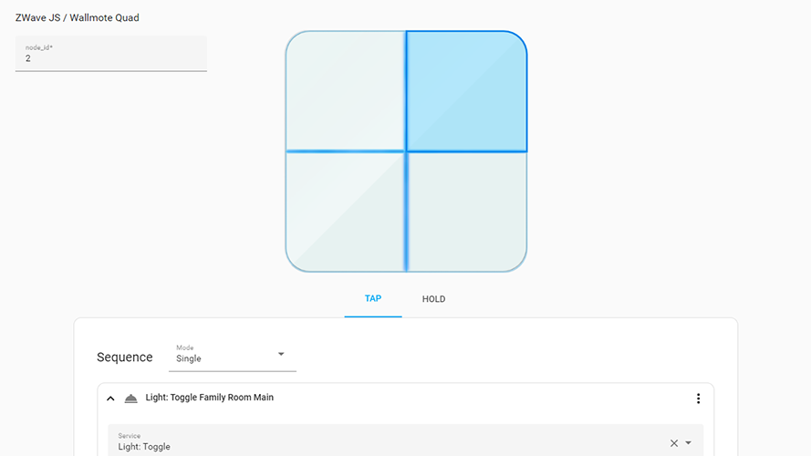

# Home Assistant Switch Manager [@Sian-Lee-SA](http://github.com/Sian-Lee-SA)

## About

Switch manager is a centralised component to handle button pushes for your wireless switches. This includes anything passed through the event bus. The component relies on switch blueprints which is easily made to allow GUI configuration of your switches and their button pushes. This helps remove clutter from the automations view as they will be handled independently by this component.

This component is still currently in ALPHA status and will most likely contain bugs yet I have done various testings.

At the moment the frontend borrows heavily from the Home Assistants frontend core modules etc which may break things in future Home Assistant updates but the backend processing should be stable and your switches should work as expected after being configured by the GUI.

> I am happy to accept any pull requests for anyone who wishes to submit missing switches from this repository as to help eliminate other users from having to build their own.

## How to install

1. Download the [component](https://github.com/Sian-Lee-SA/Home-Assistant-Switch-Manager/releases)
1. Place the folder `custom_components/switch_manager` into the `config/custom_components/` path of your home assistant installation
1. Place the folder `blueprints/switch_manager` into the `config/blueprints/` path of your home assistant installation
1. Restart Home Assistant
1. Goto Config -> Integration then find and add Switch Manager

## How to use

In the side panel you goto Switch Manager. Next click `Add Switch` and select the switch blueprint for the service/integration it's on (If you can't find your service and switch then see Blueprints below). The same switch can be defined multiple times but for different services as they differ their event data's from one another. 

Once you've selected the blueprint, you will be taken to the switch editor view. There will be an identifier text box up in the top left with a placeholder asking for the value for that key.

If you do not know the event value then goto Developer Tools -> Events and start listening for events (use * if you're unsure of the event type for your switch). Once you've started listening for events, push a button on your switch then stop the listener. View the data and you will find the event related to your switch. Inside that data you will find the identifier's value. Copy this value to the identifier's textbox on the switch editor page to bind.

Depending on the blueprint and the actions that your switch supports, you can select buttons by clicking on them from the image displayed and each button can have multiple actions eg tap, double tap and hold etc. 

Navigation and usage should be pretty straight forward. Next you can start defining actions for each of your buttons. The process is identical to making a script in Home Assistant and should be familiar. 

Once saved you can test to make sure all is working.

> Sometimes you may want certain buttons or actions handled by the devices default handler. For example, a Zigbee device may already be bound to a certain light which also imo has better response, reliability and stability. To remind you of this, you could add a stop action with a description of why the button shouldn't be changed and being handled somehwere else. Then for other actions that aren't handled else where then you can handle them with this component. It's also fine to allow an external handler to handle the button push aswell as this component so a button could turn on the light handled via Zigbee and the component could start playing music based on the same event.

## Blueprints

Blueprints are the heart of this component, once a blue print is defined for a switch then it can be reused for all switches for that specific service and type. All blueprints are yaml defined and needs to be placed inside `config/blueprints/switch_manager` eg `config/blueprints/switch_manager/philips-hue-tap.yaml`. For a more user friendly experience and for switches with multiple buttons then a png file should be placed with the same name (case sensitive) eg a philips-hue-tap.yaml blueprint image would be `config/blueprints/switch_manager/philips-hue-tap.png`.

*only PNG files are currently supported.

View other blueprint files to get a grasp of how it's constructed if the following table is hard to understand

Once a blueprint file or image file has been created or edited then you will need to restart Home Assistant for the changes to take effect.

