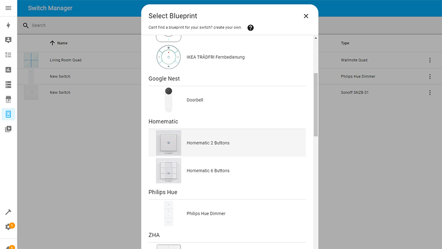

# Home Assistant Switch Manager

[](https://github.com/hacs/integration)

[](https://github.com/Sian-Lee-SA/Home-Assistant-Switch-Manager/stable) [](https://github.com/Sian-Lee-SA/Home-Assistant-Switch-Manager/stargazers) [](https://github.com/Sian-Lee-SA/Home-Assistant-Switch-Manager)
## About

Switch manager is a centralised component to handle button pushes for your wireless switches. This includes anything passed through the event bus or MQTT. The component relies on switch blueprints which is easily made to allow GUI configuration of your switches and their button pushes. This helps remove clutter from the automations view as they will be handled independently by this component.

> I am happy to accept any pull requests for anyone who wishes to submit missing blueprint for switches from this repository as to help eliminate other users from having to build their own.

#### Youtube demonstration
[](https://www.youtube.com/watch?v=m2Rlobvo5cI)

#### Switch editor page and index page
<p float="left">
  
  
</p>


## How to install

1. Download the [component](https://github.com/Sian-Lee-SA/Home-Assistant-Switch-Manager/releases)
1. Place the folder `custom_components/switch_manager` into the `config/custom_components/` path of your home assistant installation
1. Restart Home Assistant
1. Goto Config -> Integration then find and add Switch Manager

> [](https://my.home-assistant.io/redirect/config_flow_start/?domain=switch_manager)

Once the integration has been loaded, a folder with blueprints will be created in your `config/blueprints/switch_manager` home assistant path. You can add/create extra blueprints to this path.

## How to use

In the side panel you goto Switch Manager. Next click `Add Switch` and select the switch blueprint for the service/integration it's on (If you can't find your service and switch then see [Blueprints](#blueprints) below). The same switch can be defined multiple times but not for different services as they differ their event data's from one another. 

Once you've selected the blueprint, you will be taken to the switch editor view. 

#### Identifier

There will be an identifier or mqtt topic input box within the identifier dialog which can be opened from the top right menu. 

You can either enter the identifier manually or use the auto discovery button then press a button on the switch to autofill the value. There is a posibility that an identifier from some other device for the event to be discovered if that device sent an event before your button push. If this is the case and the button helper isn't getting the right identifier then you can manually find the information needed by clicking the Event|MQTT Tool link then listen for the event type needed or MQTT topic via `#`. 

**If you have changed the default MQTT base topic for a service/integration and using a blueprint provided by Switch Manager then you will need to enter that topic manually as discovery will not work!**

##### Don't know event value

If you do not know the event value then click the **Event Tool** link in the identifier dialog or goto Developer Tools -> Events and start listening for events (use * if you're unsure of the event type for your switch). Once you've started listening for events, push a button on your switch then stop the listener. View the data and you will find the event related to your switch. Inside that data you will find the identifier's value. Copy this value to the identifier's textbox on the switch editor page to bind.

##### Don't know MQTT topic

If using a MQTT service then you can either download MQTT Explorer (preferred) or listen to all topics using the MQTT integration's listener. Click the **MQTT Tool** link in the identifier dialog or goto Configuration Menu -> Integrations -> MQTT -> Configure. Next listen to the topic `#` (which means all topics), after pressing a button you will see a topic representing this, this would be your MQTT topic for Switch Manager (you can cross reference the MQTT Discovery Topic and blueprint with the mqtt data if you want to be sure).

#### Interacting with buttons

Depending on the blueprint and the actions that your switch supports, you can select buttons by clicking on them from the image displayed and each button can have multiple actions eg tap, double tap and hold etc. 

Navigation and usage should be pretty straight forward.

Remember to save before leaving the page when changes has been made! Once saved you can test to make sure all is working.

> Sometimes you may want certain buttons or actions handled by the devices default handler. For example, a Zigbee device may already be bound to a certain light which also imo has better response, reliability and stability. To remind you of this, you could add a stop action with a description of why the button shouldn't be changed and being handled somewhere else. Then for other actions that aren't handled elsewhere then you can handle them with this component. It's also fine to allow an external handler to handle the button push aswell as this component so a button could turn on the light handled via Zigbee and the component could start playing music based on the same switch action.

#### Variables

You can assign variables to the switch from the top right menu, these variables can be access through the blueprint conditions or action sequences.

The event or MQTT data can also be accessed inside your sequences via the data variable.

#### Service Set Switch Variables

You can use the service `switch_manager.set_variables` to dynamically set variables for a switch. You need to supply the switch id which can be found on the identifier dialog, url or through debugging. Add new or replace variables through the code editor (yaml formatted). These variables will be reset on save, Home Assistant restart or Switch Manager reload so it's ideal to be used for temporary references. **Note: Set Variables will be saved if the switch has been saved after using the service call**

If using the service within the switch itself, then you can just get the switch id by using `data.switch_id`.

#### button_last_state Variable

This is a special variable that you can use in your template conditions etc. This is very handy if you want something like where you're holding a button then you're pressing another button which will execute a different action within your sequence.

##### action key

When the switch is updated or saved it will reset the states to null. But when you execute an action for a button this will be stored as a last state under the action sub key. **Remember that index's start from 0**. So, if you want to check the last action from the first button defined in the blueprint and see if it's last action was the second one then you would do `data.button_last_state[0].action == 1` with 1 being the action index of that button.

##### title key

Alternatively you can test against the title of the action for better readability via the title key `data.button_last_state[0].title == 'hold'`. This method is case sensitive and needs to match the title in the blueprint which is normally all lower case to what's displayed in the editor.  

##### timestamp key

You can also access the unix timestamp that the action was executed by accessing `data.button_last_state[0].timestamp`, this can allow you to determine which button and what action was last executed or calculate how long ago the same button and action was excecuted by also accessing `data.timestamp` which is the current timestamp for the current button and action. `data.timestamp - data.button_last_state[0].timestamp` will give how much time has passed in seconds and milliseconds via decimal point since the button action of the first button to the current button and action (referencing the same button and action will give the last time it was executed and not the current execution).

You could use a choose sequence action that checks whether any other button is held and handle an action for that. Be creative! Keep in mind that this is less useful with press actions etc as they're reset upon a switch reload/save where as a hold/rotate action is more useful as they're called in an active state.

Turn on debugging and open your dev console to see the button_last_state variable and it's values.

##### Example for Philips Hue Tap Dial

Below is an example choose sequence action where if the 4th button is being held down while rotating the dial either clockwise or anti-clockwise then it will either increase or decrease the volume respectively on any playing speakers.

```yaml
# This being the clockwise rotation (change service media_player.volume_up 
# to media_player.volume_down for anti-clockwise)
choose:
  - conditions:
      - condition: template
        value_template: "{{ data.button_last_state[3].action == 1 }}"
    sequence:
      - service: media_player.volume_up
        data:
          entity_id: >-
            {{ ['media_player.study_monitor_speakers', 
            'media_player.living_room_speakers', 
            'media_player.kitchen_speaker',  'media_player.family_room_hub',
            'media_player.master_bedroom_hub'] | select('is_state', 'playing') |
            list }}
```

Further more, you could also test which button was last pressed as to determine which lights to dim via the dial.

## Blueprints

Blueprints are the heart of this component, once a blueprint is defined for a switch then it can be reused for all switches for that specific service and type. All blueprints are yaml defined and needs to be placed inside the `config/blueprints/switch_manager` path eg `config/blueprints/switch_manager/philips-hue-tap.yaml`. For a more user friendly experience and for switches with multiple buttons then a png file should be placed with the same name (case sensitive) eg a philips-hue-tap.yaml blueprint image would be `config/blueprints/switch_manager/philips-hue-tap.png`.

#### File names

File names should be defined as {service-name}-{switch-name-or-type}.yaml and all lower case. If you don't plan on posting your blueprint for others to use then it would be a good idea to prefix your file names with something unique like mycustom-{service-name}-{switch-name-or-type}.yaml. This way when you update the component with new blueprints then it won't overwrite your personal made ones if they happen to have the same file name.

#### Images

* Only PNG files are currently supported.
* Images should not exceed 500px height or 800px width
* Images with transparent background are preferred

I tend to just google the device under the images tab. Next I will skim through til I find an image that has a flat perspective (top down) and is above 800px or 500px depending on the switches ratio. Next I will open the image in photoshop then mask out the background area with the shape tool. I then control click the layer to make only the visible selected which I then crop. Lastly I resize the image to be either 800px width or 500px height depending on which one has a greater value but I do not upscale if the image is below those sizes.

Once a blueprint file or image file has been created or edited then you will need to either call the switch_manager.reload service or restart Home Assistant for the changes to take effect.

#### Debug

Once a switch is saved, you can enable debugging through the top right menu up in the top right. List conditions will use what ever is in the data object (you do not need to add data to your keys) while Template conditions and sequence templates will need to access the data variable (eg data.{event_key} ).

Once enabled, open your browser dev console to view debugging output.

### Root Structure

The following tables shows how to structure a blueprint yaml file.
> View other blueprint files to get a grasp on how it's constructed if the following table is hard to understand.

Option          | Values       | Required | Details
--              | -            | -        | -
name            | `string`     | *        | A friendly name for the switch
service         | `string`     | *        | The service or integration that this switch relates to (matching services will be grouped when selecting a blueprint from gui)
event_type      | `string`     | *        | Must match the event type through the event bus triggered by the switch (Monitor `*` events in developer tools if unsure of its value). Set this to mqtt if handling a mqtt message instead of an event (see [mqtt](#mqtt))
identifier_key  | `string`     | * If not mqtt       | The key in the event data that will uniquely identify a switch.
mqtt_topic_format| `string`    | -        | If event_type is mqtt, then this will give the user an understanding of what they should set their topic as. example: zigbee2mqtt/+/action. The MQTT topic here will also help with discovery (remember to use wildcard `+` where needed). **Make sure you set this to the standard topic if planning on sharing blueprint and not a topic that you have customised yourself through the integration**
mqtt_sub_topics | `bool`       | -        | Along with the original topic, sub topics will also be listened to and passed in for condition checking etc. If enabled then make sure the original topic doesn't use `#` wildcards or `+` at the end. Default is false
info            | `string`     | -        | You can add any additional information needed for the blueprint for users to read that wouldn't understand how it operates or has some **noteworthy** information
buttons         | `list` [Button](#button) | * | You will need to define a list of buttons even if the switch has only one or multiple. See [Button](#button) for details on defining a button
conditions      | `list` [Condition](#condition) \| `string` [Template](https://www.home-assistant.io/docs/configuration/templating/) | - | This optional list or [Template](https://www.home-assistant.io/docs/configuration/templating/) allows the switch to only accept these conditions within the event data or mqtt payload. All conditions must evaluate to true to be valid. See [Condition](#condition) for details on defining a condition

### Button

If there are more than 1 button on the switch then you should be using a png (even one button should have an image for better visualisation) and defining the buttons position with the x, y, width and height properties. This also can be expanded to being a circular shape or a svg path.

If a switch supports multiple button presses (so two buttons are pushed at the same time) then add another button with circle shape centered between the two buttons to indicate they're linked. Within the actions, the title should prefix **both**. See [Xiaomi Double Key](https://github.com/Sian-Lee-SA/Home-Assistant-Switch-Manager/blob/master/custom_components/switch_manager/blueprints/zigbee2mqtt-xiaomi-double-key-wxkg07lm.yaml) for an example.

> You will need to save the switch before feedback will be displayed on the UI, this is due to needing backend processing of a switch which isn't created until it's been saved.

> if you want more control on positioning and look then you can open the image up in inkscape (with matching width and height values for the viewBox) then draw the paths for each button and copy the d attribute of that path then paste in the d property for the button in yaml.

> Single button switches must **not** contain shape properties.

* Shape `rectangle` uses x, y, width, height
* Shape `circle` uses x, y, width
* Shape `path` uses d

Option          | Values                        | Required | Details
--              | -                             | -        | -
x               | `int`px                       | -        | The x (left, right) position of the button from top left within the image. *not valid for shape: path
y               | `int`px                       | -        | The y (up, down) position of the button from top left within the image. *not valid for shape: path
width           | `int`px                       | -        | The width of the shape rectangle or circle. *not valid for shape: path
height          | `int`px                       | -        | Only valid for shape: rectangle. The height you want the rectangle to be
d               | `string`                      | -        | Only valid if shape: path. Using svg path format
actions         | `list` [Action](#action)      | *        | Each button will have atleast one action. Each action would be the result of a tap, double tap or hold etc depending on what the switch supports.
conditions      | `list` [Condition](#condition) \| `string` [Template](https://www.home-assistant.io/docs/configuration/templating/) | -        | This optional list or [Template](https://www.home-assistant.io/docs/configuration/templating/) allows the button to only accept conditions within the event data or mqtt payload. This can help scope down to where the button was pressed. All conditions must evaluate to true to be valid. See [Condition](#condition) for details on defining a condition. 

### Action

An action would be the result of a press/tap, whether its held down or if it was pressed twice etc (all depending on what the device and/or service supports). An action must contain a title at minimum. Conditions should be used to differentiate the actions for any button.

#### Title naming convention

To unify switches added to Switch Manager, it makes sense to conform to a naming convention so the below dot points are some rules to go by.

* All characters should be lowercase
* If a button has a initial press action (where it's always called before other actions) then this should be called **init**, this is useful for setting timers and other initiating actions 
* If mechanical button then the action should be **press**. This is generally the release of a short press and **not** the moment the button was pressed as this would generally be **init**
* If touch button (as in there's no mechanical trigger) then the action should be **tap** (if unsure then resort to **press**)
* If action is double press/tap or triple press/tap and so on then the action should be **press 2x** / **tap 2x** or **press 3x** / **tap 3x** and so on
* If the button supports a hold/long and hold/long release then there should be an action for both **hold** and **hold (released)** do **NOT** use the wording **long**
* Do **NOT** use **short** or **short release** as this is generally a generic **init** or **press**
* In the case where a switch allows multiple buttons to be pushed then you can prefix each action with **both** so a dual button press would be **both press** and **both press 2x** etc. This makes it clear to a user that the button they have selected is actually for multiple buttons. See [Xiaomi Double Key](https://github.com/Sian-Lee-SA/Home-Assistant-Switch-Manager/blob/master/custom_components/switch_manager/blueprints/zigbee2mqtt-xiaomi-double-key-wxkg07lm.yaml) for an example


#### Order convention

Actions should be ordered logically. This would be **init** -> **press** -> **press 2x** -> **press 3x** -> **hold** -> **hold (released)** -> Then anything that is more unique like **shake**, **viabrate** and so on.

Option          | Values                          | Required | Details
--              | -                               | -        | -
title           | `string`                        | *        | Please read naming convention to better understand what title should be used
conditions      | `list` [Condition](#condition) \| `string` [Template](https://www.home-assistant.io/docs/configuration/templating/)  | -        | This optional list or [Template](https://www.home-assistant.io/docs/configuration/templating/) allows the action to only accept conditions within the event data or mqtt payload. This can help scope down to the kind of action if the button has multiple. All conditions must evaluate to true to be valid. See [Condition](#condition) for details on defining a condition. 

### Condition

Conditions will traverse down the switch from root -> button -> action. The process of the heirachy will stop if the condition fails. Please use list over templates.

#### Template

You can use Home Assistant generic condition template to validate a condition https://www.home-assistant.io/docs/configuration/templating/. Define the property `conditions` as a string instead of an array. Lists are still preferred as rendering templates takes extra processing times. The event or mqtt data are passed in on the data variable. Switch defined variables can be accessed through the `data.variables` object.

##### template example
```yaml
conditions: "{{ data.value == 'KeyPressed' and data.topic_basename == 'left_button' }}"
```

#### List

Conditions defined as a list evaluates the event/mqtt data. If the key doesn't exist then it also evaluates to false. Use dot notation for the key to traverse nested dictionaries. Switch defined variables can be accessed using the `variables` key. **All conditions must be true to be valid**.

Option          | Values       | Required | Details
--              | -            | -        | -
key             | `string`     | *        | The key to match in the event data or mqtt payload
value           | `string`     | *        | The value to match for the key

##### list example
```yaml
conditions:
  - key: value
    value: KeyPressed
  - key: group
    value: 1
```

### MQTT

MQTT is handled differently to events and the incoming data is that of a payload... If a payload is not json formatted then it will be passed in as the key `payload` containing the string. The payload itself is what the conditions will check against. Included in the data is topic and topic_basename as this can be useful for condtions where a topic is listened via `#` or `+`.

To help discover a switch when trying to discover from GUI then use a format for the topic in `mqtt_topic_format` that will scope down to the best possibility. For zigbee2mqtt this is generally `zigbee2mqtt/+/action`. The `+` is a wild card saying to match a single level (so anything between the forward slash `/`). For more information visit [here](https://www.hivemq.com/blog/mqtt-essentials-part-5-mqtt-topics-best-practices/). Sharing blueprints should be set to the default topic of the integration and not one that you have changed to. 

If you want a condition on a payload that isn't json formatted then you would do as follows:
```yaml
- key: payload
  value: tap
```

Otherwise you will check against the payloads keys and values.

### Blueprint Examples

The follow example is a blueprint for a Wallmote Quad which has 4 buttons with each button having 2 actions (tap and hold). This blueprint is also designed for the Z-Wave JS Integration and handles the event type `zwave_js_value_notification`. With in that we set the identifier key to `node_id` as this key is a way to distinguish which switch the event refers to. Further along we check from the root condition whether the event data has `property: scene` otherwise the switch has no need to further proceed nor does the component process other child conditions. We do this again for the buttons and actions to scope down whether the incoming event should be handled by the switch and its buttons or actions.

Each button has a shape of a path as it was traced through inkscape, drawing the shapes whether be rectangle, circle or path allows GUI representation and allows to select individual buttons within the GUI switch editor.

> You should wrap your conditon values in qoutes as 001 equates to an int which would end up being 1 and will not match a value of 001 within the event data.

```yaml
name: Wallmote Quad
service: Z-Wave JS
event_type: zwave_js_value_notification
identifier_key: node_id
conditions:
  - key: property
    value: scene
buttons:
  - d: m 45.944466,2.0341694 h 176.769524 v 219.3817306 h -219.1028571 l 0,-177.048398 a 42.333333,42.333333 135 0 1 42.3333331,-42.3333326 z
    conditions:
      - key: property_key
        value: '001'
    actions:
      - title: tap
        conditions:
          - key: value
            value: KeyPressed
      - title: hold
        conditions:
          - key: value
            value: KeyHeldDown
  - d: m 222.78056,2.0572453 h 176.76953 a 42.333333,42.333333 45 0 1 42.33333,42.3333327 v 177.048392 h -219.10286 z
    conditions:
      - key: property_key
        value: '002'
    actions:
      - title: tap
        conditions:
          - key: value
            value: KeyPressed
      - title: hold
        conditions:
          - key: value
            value: KeyHeldDown
  - d: m 3.4383569,221.24492 h 219.1028631 v 219.38173 h -176.76953 a 42.333333,42.333333 45 0 1 -42.3333331,-42.33333 z
    conditions:
      - key: property_key
        value: '003'
    actions:
      - title: tap
        conditions:
          - key: value
            value: KeyPressed
      - title: hold
        conditions:
          - key: value
            value: KeyHeldDown
  - d: m 222.71397,221.28836 h 219.10286 v 177.0484 a 42.333333,42.333333 135 0 1 -42.33333,42.33333 l -176.76953,0 z
    conditions:
      - key: property_key
        value: '004'
    actions:
      - title: tap
        conditions:
          - key: value
            value: KeyPressed
      - title: hold
        conditions:
          - key: value
            value: KeyHeldDown
```

#### MQTT Example

```yaml
name: Sonoff SNZB 01
service: Zigbee2MQTT
event_type: mqtt
mqtt_topic_format: zigbee2mqtt/+/action
buttons:
  - actions:
      - title: press
        conditions:
          - key: payload
            value: single
      - title: press 2x
        conditions:
          - key: payload
            value: double
      - title: hold
        conditions:
          - key: payload
            value: long
```


## Troubleshoot

#### Update broke my switch causing blueprint mismatch

If by chance your switches are invalid because of a blueprint change, then this would generally mean a blueprint has added either more buttons or extra actions. We try to avoid this and as this integration is still in it's infancy stages there will be changes from time to time and while these changes happen, so does the rules in adding a blueprint to this repo (this should hopefully iron out these issues in the future).

To fix this, edit the switch then click **fix**. Once the switch has been updated to match the blueprint, you'll want to ensure your actions and sequences are in the right spots! This is by design to have you manually click fix as to ensure you're aware of the changes and how your buttons and actions have changed.

## Donate

<a href="https://www.paypal.com/donate/?business=A82MM255CXF9L&no_recurring=0&item_name=Donating+will+help+justify+my+time+coding+and+doing+projects+that+also+benifits+others.+Any+amount+is+greatly+appreciated%21&currency_code=AUD"></a>
[](https://www.buymeacoffee.com/SianLee)